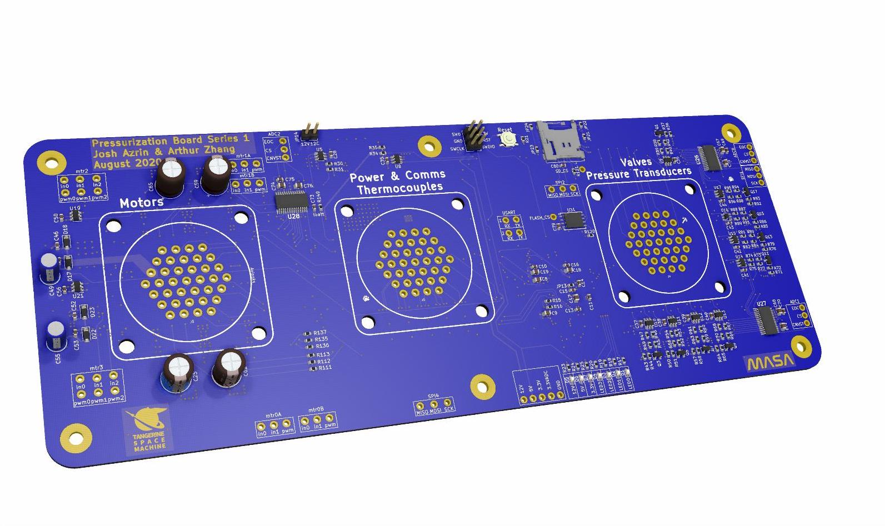
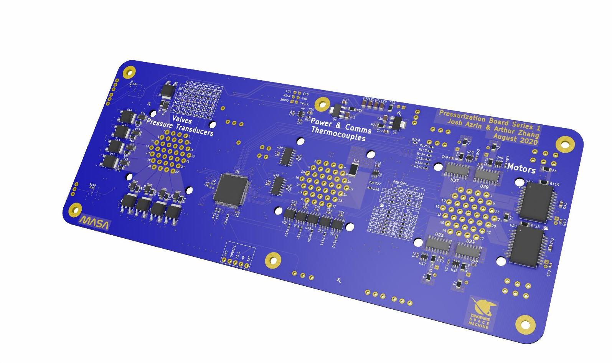
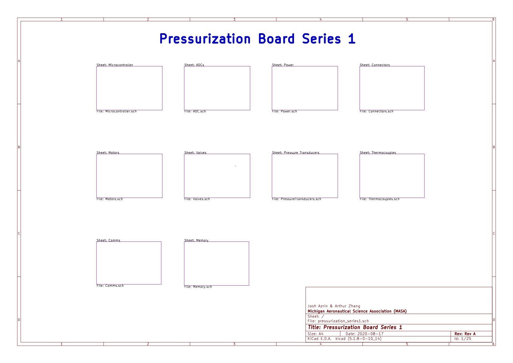
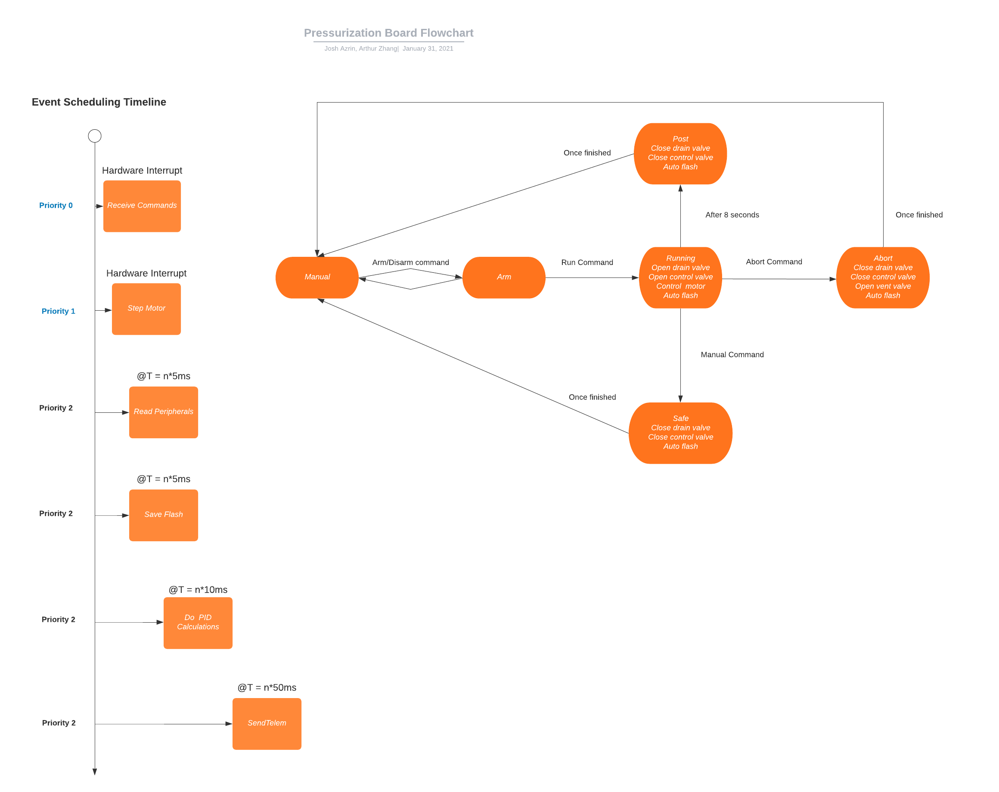

# Combustion-Control
Designed by Josh Azrin and Arthur Zhang.

|:--:| 
| *Front of PCB* |

Combustion-Control is a project that Josh and I researched and designed to actively balance the liquid fuel tanks for rockets using a PID control loop and various peripherals. We are currently working with the ATLO team to integrate their custom PID control loop into this system. Currently, we are using this PCB on Tangerine Space Machine, a rocket that students are designing at Michigan Aeronautics and Science Association (MASA), a project design team at the University of Michigan.

## Project Overview
1. Overview
1. Board Specs
2. Key Features
3. Firmware Architecture
4. Additional Information

## Overview

|:--:| 
| *Diagram of Pressure Fed Rocket* |

Liquid fuel rockets typically use a pressurized gas like helium to force fuel and oxidizer together into a combustion chamber. In order to maintain a steady combustion, we must ensure that the tank pressures exceed the combustion chamber pressure. We plan on accomplishing this by controlling the flow rate of the the fuel and oxidizer together using a needle valve. This method uses simple plumbing and removes the need for complex turbopumps. Along with Josh, we designed a PCB that supports this functionality. In addition, I have also architected the firmware for carrying out PID control, Command and Data Handling, and interfacing with peripherals.

## Board Specs

|:--:| 
| *Back of PCB* |

The completed board is an eight layer PCB with the stackup
listed below:

* Analog
* Ground
* North South Signals
* 3v3
* 12v
* East West Signals
* Ground Power

We chose to use 8 layers for this iteration for this iteration to reduce the layout
complexity and remove concerns about electromagnetic interference. However, on the
future flight board, I will focus on reducing the number of layers and condensing
the placement of the components.

* 9 Dual State Valves (12V 5A continuous)
* 3 Analog to Digital Converters (12 bit resolution)
* 6 Pressure Transducers
* 4 H-Bridge Motor Drivers (12V 15A)
* 2 Three Phase Motor Drivers
* 6 Hall Effect Sensors
* 2 Potentiometers
* 2 Full Duplex RS-422 Communication Channels
* 5 Thermocouples
* 1 Non-volatile Flash Memory Chip
* 1 Micro SD Card Reader

The board organizational hierachy can be seen in the schematic below.

## Key Features

Utilizing the redundant RS-422 communication chips, the system is able transceive
data with a ground computer with the assistance of a wireless transceiver. This 
becomes extremely important because it gives us the ability to monitor the rocket state for
anomalies and abort the procedure if needed.

In addition, the board supports multiple methods of storing data. During pressurization
tests, we are able to write telemetry directly into non-volatile flash memory and
a micro sd card. This creates an additional level of data redundancy on the board 
in case parts of the system become damaged and unusable during testing. 

## Firmware Architecture

|:--:| 
| *State Diagram of Firmware* |

The system can be one of these various states (in orange) and transitions between 
the Idle, Armed, and Done states by receiving commands from a remote computer. 
These states are for the user to check the system for nominal behavior. In the Running 
and Abort Case Handling states, the board is in control of the system and will continue 
executing the PID control loop until commanded to stop or potentially dangerous 
system behavior is detected. Once the pressurization procedure is proceeded, all of the 
telemetry data logged at high speed is dumped from flash memory to the remote computer
via an ethernet using RS-422.

Because there are several time sensitive tasks that must be completed, I used hardware
timers to guarantee that they are executed precisely. For less critical functions,
the system uses a virtual timer to approximately execute them at the correct time.

Along with writing C code for interfacing with peripherals using SPI and UART, I also
developed a telemetry packet format and firmware for communicating with external 
PCBs and computers. The communication packet COBBs encodes data to increase its 
resilence to errors and contains useful information like a 32 bit timestamp, packet
target address, and simple checksum.

For additional information on the firmware architecture, please consult me (Arthur Zhang)
and I will be happy to discuss more details on its implementation.

## Additional Information

### Project Setup Details

This project uses KiCAD, a free PCB and schematic design tool. It uses the default
schematic, footprint, and 3d model library paths. In addition, the repository for
firmware is built on the STM32CubeIDE platform.

### Reviewers

Special thanks to Marion Anderson and Alex Davenport for constantly reviewing and 
providing guidance on this project.
